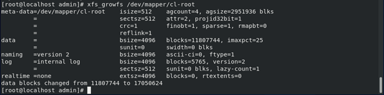

<div align="right">
    <div><b>Language:</b> VI | <a href="../content/Linux-LVM-en.md">EN</a></div>
    <div><i>Your language contributions are welcome!</i></div>
</div>
<p align="center">
    <a href="../content/Linux-LVM-vi.md">	
        
    </a>
</p>

# Nội dung
- [Nội dung](#nội-dung)
- [Tổng quan về Logical Volume Management](#tổng-quan-về-logical-volume-management)
  - [Giới thiệu về LVM](#giới-thiệu-về-lvm)
  - [Một số ứng dụng của LVM](#một-số-ứng-dụng-của-lvm)
  - [Cấu trúc của LVM](#cấu-trúc-của-lvm)
  - [Các thành phần của LVM](#các-thành-phần-của-lvm)
    - [Hard drives – Drives](#hard-drives--drives)
    - [Partition](#partition)
    - [Physical Volumes – PV](#physical-volumes--pv)
    - [Volume Group – VG](#volume-group--vg)
    - [Logical Volume – LV](#logical-volume--lv)
    - [extent](#extent)
- [Cài đặt và cấu hình LVM trên hệ điều hành CentOS 8 nền tảng ảo hóa VMware](#cài-đặt-và-cấu-hình-lvm-trên-hệ-điều-hành-centos-8-nền-tảng-ảo-hóa-vmware)
  - [Tạo máy ảo CentOS và gắn thêm 3 ổ cứng ảo](#tạo-máy-ảo-centos-và-gắn-thêm-3-ổ-cứng-ảo)
  - [Tạo các Partition cho các ổ đĩa mới](#tạo-các-partition-cho-các-ổ-đĩa-mới)
  - [Tạo Physical Volume](#tạo-physical-volume)
  - [Tạo Volume Group](#tạo-volume-group)
  - [Tạo Logical Volume](#tạo-logical-volume)
  - [Tạo mount point và thực hiện mount LVM mới](#tạo-mount-point-và-thực-hiện-mount-lvm-mới)
- [Mở rộng/thay đổi kích thước Logical Volume](#mở-rộngthay-đổi-kích-thước-logical-volume)
  - [Mở rộng Volume Group](#mở-rộng-volume-group)
  - [Tăng kích thước Logical Volume](#tăng-kích-thước-logical-volume)
  - [Giảm dung lượng Logical Volume và Volume Group](#giảm-dung-lượng-logical-volume-và-volume-group)
  - [Auto-mount Logical Volume](#auto-mount-logical-volume)
- [Snapshot và restore Logical Volume](#snapshot-và-restore-logical-volume)
  - [5.1.	Tạo snapshot Logical Volume](#51tạo-snapshot-logical-volume)
  - [Tăng thêm dung lượng cho snapshot](#tăng-thêm-dung-lượng-cho-snapshot)
  - [Restore Logical Volume](#restore-logical-volume)
- [Remove Logical Volume](#remove-logical-volume)
- [Remove Volume Group](#remove-volume-group)
- [Remove Physical Volume](#remove-physical-volume)
- [LVM Thin Provisioning](#lvm-thin-provisioning)
  - [Giới thiệu Thin Provisioning](#giới-thiệu-thin-provisioning)
  - [Cấu hình Thin Provisioning](#cấu-hình-thin-provisioning)
    - [Tạo Volume group](#tạo-volume-group-1)
    - [Tạo thin pool](#tạo-thin-pool)
    - [Tạo thin volume](#tạo-thin-volume)
    - [Tạo filesystem và mount các volume](#tạo-filesystem-và-mount-các-volume)
- [Tính năng Manage Multiple Logical Volume Management Disk sử dụng Striping I/O](#tính-năng-manage-multiple-logical-volume-management-disk-sử-dụng-striping-io)
- [Tính năng LVM Migration](#tính-năng-lvm-migration)
- [Tăng dung lượng ổ cứng chứa OS và mở rộng phân vùng root (/)](#tăng-dung-lượng-ổ-cứng-chứa-os-và-mở-rộng-phân-vùng-root-)
- [Tăng dung lượng phân vùng root (/) bằng cách gắn thêm ổ cứng mới](#tăng-dung-lượng-phân-vùng-root--bằng-cách-gắn-thêm-ổ-cứng-mới)
- [Back to main page](#back-to-main-page)

# Tổng quan về Logical Volume Management
## Giới thiệu về LVM
LVM (**Logical Volume Management**) là một công nghệ giúp quản lý các thiết bị lưu trữ dữ liệu trên các hệ điều hành Linux. Công nghệ này cho phép người dùng gom nhóm các ổ cứng vật lý lại và phân tách chúng thành những phân vùng nhỏ hơn, dễ dàng mở rộng các phân vùng này khi cần thiết.


LVM cho phép ấn định không gian đĩa cứng thành những Logical Volume khiến cho việc thay đổi kích thước trở nên dễ dàng hơn (so với partition). Với **Logical Volume Manager** (LVM) bạn có thể thay đổi kích thước mà không cần phải sửa lại partition table của OS.

## Một số ứng dụng của LVM
*	Quản lý một lượng lớn ổ đĩa một cách dễ dàng.
*	Dễ dàng dồn, tách đĩa.
*	Điều chỉnh phân vùng ổ cứng một cách linh động.
*	Backup hệ thống bằng cách snapshot các phân vùng ổ cứng (real-time).
*	Migrate dữ liệu dễ dàng.

## Cấu trúc của LVM
<p align="center">
    <a></a>
</p>

## Các thành phần của LVM
LVM phân các lớp trên các ổ cứng vật lý bao gồm các thành phần sau:

### Hard drives – Drives
Thiết bị lưu trữ dữ liệu, ví dụ như trong linux nó là `/dev/sda`.

### Partition
+ Partitions là các phân vùng của Hard drives, mỗi Hard drives có 4 partition, trong đó partition bao gồm 2 loại là primary partition và extended partition.
+ Primary partition: Phân vùng chính, có thể khởi động , mỗi đĩa cứng có thể có tối đa 4 phân vùng này.
+ Extended partition: Phân vùng mở rộng

### Physical Volumes – PV
* Ổ cứng vật lý từ hệ thống (đĩa cứng, partition, iSCSI LUN, SSD…) là đơn vị cơ bản để LVM dùng để khởi tạo các Volume Group. Trên mỗi một PV sẽ chứa khoảng 1 MB header ghi dữ liệu về cách phân bố của Volume Group chứa nó. Header này sẽ hỗ trợ rất nhiều trong việc phục hồi dữ liệu khi có sự cố xảy ra.
* Là những thành phần cơ bản được sử dụng bởi LVM dể xây dựng lên các tầng cao hơn . Một Physical Volume không thể mở rộng ra ngoài phạm vi một ổ đĩa. Chúng ta có thể kết hợp nhiều Physical Volume thành Volume Groups.

### Volume Group – VG
* Là tập hợp các ổ cứng vật lý (PV) thành một kho lưu trữ chung với tổng dung lượng của các ổ đĩa con. Mỗi khi ta thêm một PV vào VG, LVM sẽ tự động chia dung lượng trên PV thành nhiều Physical Extent với kích cỡ bằng nhau. Và từ VG, ta có thể tạo ra nhiều Logical Volume và dễ dàng chỉnh sửa dung lượng của chúng.
* Nhiều Physical Volume trên những ổ đĩa khác nhau được kết hợp lại thành một Volume Group.
* Volume Group được sử dụng để tạo ra các Logical Volume, trong đó người dùng có thể tạo, thay đổi kích thước, lưu trữ, gỡ bỏ và sử dụng.

### Logical Volume – LV
Là các phân vùng luận lý được tạo ra từ VG. Logical Volume tương tự như các partition trên ổ cứng bình thường nhưng linh hoạt hơn vì kích thước của LV có thể được dễ dàng thay đổi theo thời gian thực mà không lo làm gián đoạn hệ thống. Sở dĩ ta có thể dễ dàng thay đổi được kích thước của LV vì LV được chia thành nhiều Logical Extent, mỗi Logical Extent này sẽ được mapping tương ứng với 1 Physical Extent trên các ổ đĩa.

### extent
extent là đơn vị nhỏ nhất của VG. Mỗi một volume được tạo ra từ VG chứa nhiều extent nhỏ với kích thuớc cố định bằng nhau. Các extent trên LV không nhất thiết phải nằm liên tục với nhau trên ổ cứng vật lý bên dưới mà có thể nằm rải rác trên nhiều ổ cứng khác nhau. Extent chính là nền tảng cho công nghệ LVM, các LV có thể được mở rộng hay thu nhỏ lại bằng cách add thêm các extent hoặc lấy bớt các extent từ volume này.

***

# Cài đặt và cấu hình LVM trên hệ điều hành CentOS 8 nền tảng ảo hóa VMware
## Tạo máy ảo CentOS và gắn thêm 3 ổ cứng ảo
Chọn **Edit virtual machine settings**
<p align="center">
    <a></a>
</p>

Thực hiện add thêm **Hard Disk** cho máy ảo
<p align="center">
    <a></a>
</p>

Khởi động máy ảo và kiểm tra trạng thái ổ đĩa bằng lệnh:

```shell
[admin@localhost ~]$ lsblk
```

<p align="center">
    <a></a>
</p>

## Tạo các Partition cho các ổ đĩa mới
Tạo Partition cho `sdb`, sử dụng lệnh:

```shell
[root@localhost admin]# fdisk /dev/sdb
```

<p align="center">    
    <a></a>
</p>

Đã tạo thành công Partition LVM `sdb1` có dung lượng 20G. Thực hiện tương tự đối với `sdc`. Kết quả sau khi tạo Partition:

<p align="center">
    <a></a>
</p>

## Tạo Physical Volume
Tạo các Physical Volume cho `sdb1` và `sdc1` bằng lệnh sau:

```shell
[root@localhost admin]# pvcreate /dev/sdb1 /dev/sdc1
```

<p align="center">    
    <a></a>
</p>

Quét đĩa để kiểm tra:

```shell
[root@localhost admin]# lvmdiskscan
```

<p align="center">  
    <a></a>
</p>

Để xem các PV vừa tạo ra ta sử dụng lệnh:

```shell
[root@localhost admin]# pvs
```

<p align="center">    
    <a></a>
</p>

Hiển thị thông tin chi tiết Physical Volume `/dev/sdb1` bằng lệnh:

```shell
[root@localhost admin]# pvdisplay /dev/sdb1
```

<p align="center">  
    <a></a>
</p>

## Tạo Volume Group
Để tạo một volume group mới có tên “vg001” từ các PV `sdb1` và `sdc1` sử dụng lệnh sau:

```shell
[root@localhost admin]# vgcreate vg001 /dev/sdb1 /dev/sdc1
```

<p align="center">  
    <a></a>
</p>

Để xem các VG vừa tạo sử dụng lệnh:

```shell
[root@localhost admin]# vgs
```

<p align="center">    
    <a></a>
</p>

Kiểm tra thông tin VG `vg001` bằng lệnh sau:

```shell
[root@localhost admin]# vgdisplay vg001
```

<p align="center">  
    <a></a>
</p>

VG `vg001` được tạo từ hai PV `sdb1` (20GB) và `sdc1` (20GB) nên sẽ có dung lượng là 40GB.
Có thể thêm một hay nhiều PV khác vào VG hiện có bằng lệnh sau:

```shell
[root@localhost admin]# vgextend vg001 /dev/sdb2
```

(trong đó, `/dev/sdb2` là PV mới muốn thêm vào VG `vg001` hiện có)
## Tạo Logical Volume
Giả sử cần tạo 02 LV có tên là “projects” với dung lượng 10GB và “backups” sử dụng toàn bộ dung lượng còn lại của VG `vg001`. Chạy các lệnh sau:

```shell
[root@localhost admin]# lvcreate -n projects -L 10G vg001
[root@localhost admin]# lvcreate -n backups -l 100%FREE vg001
```

<p align="center">  
    <a></a>
</p>

Sử dụng lệnh `lvs` để xem các LV vừa tạo:

<p align="center">
    <a></a>
</p>

Hoặc có thể xem toàn bộ thông tin của một LV “projects” bằng lệnh sau:

```shell
[root@localhost admin]# lvdisplay vg001/projects
```

<p align="center">  
    <a></a>
</p>

## Tạo mount point và thực hiện mount LVM mới
Kiểm tra thông tin sử dụng không gian đĩa trên hệ thống ta thấy `projects` và `backups` chưa thể sử dụng:

<p align="center">
    <a></a>
</p>

Để sử dụng được LV, ta cần tạo filesystem. Tạo filesystem cho `projects` sử dụng ext4 (vì ext4 cho phép tăng hoặc giảm kích thước của mỗi LV, với xfs chỉ cho phép tăng kích thước) bằng lệnh sau:

```shell
[root@localhost admin]# mkfs.ext4 /dev/vg001/projects
```

<p align="center">  
    <a></a>
</p>

Tạo thư mục mới tên `projects` và mount vào `/dev/vg001/projects`

```shell
[root@localhost admin]# mkdir /projects
[root@localhost admin]# mount /dev/vg001/projects /projects/
```

Kiểm tra lại kết quả mount bằng lệnh sau:

```shell
[root@localhost admin]# df -HT
```

<p align="center">    
    <a></a>
</p>

Mount thành công LV `projects` vào `/projects/`, `/projects/` hiện tại đã có thể sử dụng để lưu trữ dữ liệu.

<p align="center">
    <a></a>
</p>

***

# Mở rộng/thay đổi kích thước Logical Volume
## Mở rộng Volume Group
Kiểm tra dung lượng VG `vg001` hiện tại bằng lệnh:

```shell
[root@localhost projects]# vgdisplay vg001
```

<p align="center"> 
    <a></a>
</p>

Dung lượng của `vg001` hiện tại `VG Size` là 40GB, `Free` là 0GB. Để tăng thêm dung lượng cho `vg001` ta tạo PV mới rồi thêm PV này vào `vg001`.
Tạo Partition `sdb2` mới dung lượng 16GB:

<p align="center">
    <a></a>
</p>

Tạo PV mới `/dev/sdb2` bằng lệnh:

```shell
[root@localhost admin]# pvcreate /dev/sdb2
```

<p align="center">  
    <a></a>
</p>

Mở rộng VG `vg001` bằng cách thêm PV `sdb2` vào `vg001`, sử dụng lệnh:

```shell
[root@localhost admin]# vgextend vg001 /dev/sdb2
```

<p align="center">  
    <a></a>
</p>

Dụng lượng của `vg001` lúc này đã được tăng lên thành 56GB và còn trống 16GB. Dung lượng của `vg001` đã được tăng thêm 16GB, như vậy ta có thể tăng kích thước của LV `projects` lên thêm tối đa dưới 16GB.
## Tăng kích thước Logical Volume
Kiểm tra dung lượng của LV `projects` hiện tại:

```shell
[root@localhost projects]# lvdisplay /dev/vg001/projects
```

<p align="center">  
    <a></a>
</p>

Tăng thêm dung lượng cho `projects` thêm 10GB bằng lệnh:

```shell
[root@localhost admin]# lvextend -L +10GB /dev/vg001/projects
```

<p align="center">    
    <a></a>
</p>

Kích thước của projects lúc này đã được tăng lên thành 20GB:
Sau khi tăng kích thước của LV ta cần thay đổi kích thước tệp hệ thống filesystem và xác nhận thay đổi bằng lệnh sau (đối với ext4/ext2/ext3):

```shell
[root@localhost admin]# resize2fs /dev/vg001/projects
```

<p align="center">  
    <a></a>
</p>

Dung lượng của `projects` lúc này đã được tăng lên và có thể sử dụng được:

<p align="center">
    <a></a>
</p>

## Giảm dung lượng Logical Volume và Volume Group
Khi muốn giảm dung lượng các Logical Volume, ta cần phải chú ý vì nó có thể bị lỗi hoặc bị mất dữ liệu trong khi chúng ta giảm dung lượng của các Logical Volume. Để đảm bảo an toàn khi giảm Logical Volume cần thực hiện các bước sau:
1.	Trước khi bắt đầu, cần sao lưu dữ liệu để tránh mất mát dữ liệu khi có sự cố xảy ra.
2.	Khi giảm dung lượng Logical Volume chúng ta phải ngắt kết nối hệ thống tệp trước khi giảm.
3.	Để giảm dung lượng Logical Volume, cần thực hiện đầy đủ và cẩn thận các bước cần thiết dưới đây:
    * Ngắt kết nối file system.
    * Kiểm tra file system sau khi ngắt kết nối.
    * Giảm file system.
    * Giảm kích thước Logical Volume.
    * Kiểm tra lỗi cho file system.
    * Mount lại file system và kiểm tra kích thước của nó.


Giả sử cần giảm dung lượng của LV `projects` lại còn 10GB và giảm dung lượng VG `vg001` xuống còn 40GB, ta thực hiện các bước như sau:


Đầu tiên, thực hiện unmount filesystem bằng lệnh:

```shell
[root@localhost ~]# umount /dev/mapper/vg001-projects
```

<p align="center"> 
    <a></a>
</p>

Kiểm tra lỗi filesystem bằng lệnh:

```shell
[root@localhost ~]# e2fsck -f /dev/vg001/projects
```

<p align="center">  
    <a></a>
</p>

Nếu không có điều bất thường xảy ra, ta có thể giảm dung lượng của `projects` xuống theo nhu cầu. Giảm dung lượng LV `projects` bằng lệnh:

```shell
[root@localhost ~]# lvreduce -L 10G /dev/vg001/projects
```

Sau đó gõ `y` để xác nhận: 

```shell
Do you really want to reduce vg001/projects? [y/n]: y
```

<p align="center">  
    <a></a>
</p>

Kiểm tra lại lần nữa để đảm bảo filesystem không bị lỗi:

```shell
[root@localhost admin]# e2fsck -f /dev/vg001/projects
```

<p align="center">  
    <a></a>
</p>

Sau cùng để sử dụng được thì cần mount lại filesystem và kiểm tra dung lượng sau khi giảm.
Mount lại LV `projects`:

```shell
[root@localhost admin]# mount /dev/vg001/projects /projects
```

Kiểm tra lại dung lượng:

```shell
[root@localhost admin]# df -HT
```

<p align="center">  
    <a></a>
</p>

Dung lượng VL `projects` giờ đã được giảm xuống còn 10GB. Tiếp theo, để giảm dung lượng Volume Group ta cũng thực hiện tương tự. Đầu tiên, unmount `/dev/vg001/projects`

```shell
[root@localhost ~]# umount /dev/vg001/projects
```

<p align="center">  
    <a></a>
</p>

Kiểm tra lỗi filesystem bằng lệnh:

```shell
[root@localhost admin]# e2fsck -f /dev/vg001/projects
```

<p align="center">    
    <a></a>
</p>

Giảm dung lượng `vg001` xuống còn 40GB bằng cách gỡ PV `sdb2` khỏi `vg001`, sử dụng lệnh sau:

```shell
[root@localhost ~]# vgreduce vg001 /dev/sdb2
```

<p align="center">  
    <a></a>
</p>

VG `vg001` lúc này chỉ còn 40GB:

<p align="center">
    <a></a>
</p>

Sau cùng kiểm tra filesystem và mount lại `/dev/vg001/projects`

<p align="center">
    <a></a>
</p>

## Auto-mount Logical Volume
Các cấu hình LVM như trên chỉ là tạm thời, khi hệ thống khởi động lại sẽ không tự động mount các LV. Để tự động mount các LV khi hệ thống khởi động, ta cần hình trong file `/etc/fstab`.


Cấu trúc file `/etc/fstab` như sau:

<p align="center">
    <a></a>
</p>

Cấu trúc của một trường gồm các phần:

```shell
[Device] [Mount Point] [File System Type] [Options] [Dump] [Pass]
```

`[Device]` có thể sử dụng UUID hoặc dạng path. Xác định UUID của volume bằng lệnh sau:

```shell
[root@localhost ~]# blkid
```

<p align="center"> 
    <a></a>
</p>

Để tự động mount projects khi khởi động, ta mở file `/etc/fstab` và thêm dòng sau vào cuối file và lưu lại.

```shell
/dev/mapper/vg001-projects   /projects        ext4    defaults        0 0
```

Hoặc

```shell
UUID=" 2d3b52df-715c-4740-be30-e7cc5bbe07de "	/projects        ext4    defaults        0 0
```
<p align="center"> 
    <a></a>
</p>

# Snapshot và restore Logical Volume
## 5.1.	Tạo snapshot Logical Volume
Kiểm tra `projetcs` trước khi tạo snapshot:

<p align="center">
    <a></a>
</p>

Kiểm tra dung lượng trống của VG `vg001` bằng lệnh:

```shell
[root@localhost ~]# vgs
```

<p align="center">    
    <a></a>
</p>

Để tạo được snapshot cho LV `projects` thuộc VG vg001 thì `vg001` cần có không gian trống `VFree`. Ta cần tăng dung lượng trống cho `vg001`:

<p align="center">
    <a></a>
</p>

Dung lượng trống của `vg001` là cột `VFree` với giá trị 16GB, dung lượng này có thể dùng để tạo snapshot.
Tạo snapshot `projects-snap01` có dung lượng 10GB cho `/dev/vg001/projects` bằng lệnh sau:

```shell
[root@localhost ~]# lvcreate -s -L 10G -n projects-snap01 /dev/vg001/projects
```

<p align="center">  
    <a></a>
</p>

**Chú ý**: Chỉ có thể tạo được snapshot có dung lượng nhỏ hơn dung lượng `vg001` còn trống.


Lệnh xóa snapshot:

```shell
[root@localhost admin]# lvremove /dev/vg001/VinhLong-snap01
```

<p align="center">  
    <a></a>
</p>

## Tăng thêm dung lượng cho snapshot
Để tăng thêm dung lượng cho snapshot `projects-snap01` ta thực hiện tương tự như tăng dung dung cho một Logical Volume, sử dụng lệnh sau:

```shell
[root@localhost admin]# lvextend -L +5G /dev/vg001/projects-snap01
```

## Restore Logical Volume
Trước khi restore cần unmount tệp hệ thống. Lệnh unmount:

```shell
[root@localhost admin]# umount /dev/mapper/vg001-projects
```

<p align="center">  
    <a></a>
</p>

Nội dung của `projects` trước khi restore:

<p align="center">
    <a></a>
</p>


Để restore lại snapshot, ta sử dụng lệnh sau:

```shell
[root@localhost admin]# lvconvert --merge /dev/vg001/projects-snap01
```

<p align="center"> 
    <a></a>
</p>

Sau khi restore lại thì snapshot sẽ được tự động xóa. Kiểm tra lại dữ liệu tại thời điểm snapshot sẽ được trả về lại như ban đầu:

<p align="center">
    <a></a>
</p>

***

# Remove Logical Volume
Trước khi remove LV, ta phải remove mục nhập `fstab` đã đặt trước đó và ngắt kết nối điểm lắp (mount point). 

<p align="center">
    <a></a>
</p>

**Ví dụ**: bây giờ chúng ta sẽ loại bỏ LV `backups`. Trước tiên hãy đảm bảo rằng không có mục nhập nào trong tệp `fastab` cho `backups` và sau đó ngắt kết nối điểm gắn kết `backups`.

<p align="center">
    <a></a>
</p>

<p align="center">
    <a></a>
</p>

Sử dụng lệnh sau để thực hiện remove LV `backups`:

```shell
[root@localhost ~]# lvremove /dev/vg001/backups
```

<p align="center"> 
    <a></a>
</p>

Sử dụng lệnh sau để thực hiện remove LV `backups`:

```shell
[root@localhost ~]# lvremove /dev/vg001/backups
```

<p align="center">  
    <a></a>
</p>

***

# Remove Volume Group
Để remove VG `vg001` ta sử dụng lệnh sau:

```shell
[root@localhost ~]# vgremove vg001
```

Hoặc thêm tùy chọn `-f` để xác nhận xóa tất cả các LV có trong VG:

```shell
[root@localhost ~]# vgremove -f vg001
```

<p align="center">  
    <a></a>
</p>

***

# Remove Physical Volume
Để remove các PV `sdb1`, `sdb2`, `sdc1` ta sử dụng lệnh sau:

```shell
[root@localhost ~]# pvremove /dev/sdb1 /dev/sdb2 /dev/sdc1
```

<p align="center">
    <a></a>
</p>

***

# LVM Thin Provisioning
## Giới thiệu Thin Provisioning
**Thin Provisioning** là tính năng cấp phát ổ cứng dựa trên sự linh hoạt của LVM, nó cho phép tạo ra LV lớn hơn các dung lượng có sẵn. LVM chỉ cấp phát ổ cứng khi có dữ liệu thật được ghi xuống, vì vậy, tính năng này giúp tiết kiệm được dung lượng cho hệ thống, tận dụng một cách tối ưu dung lượng lưu trữ. Tuy nhiên, tính năng này sẽ gây ra phân mãnh hệ thống và tình trạng over provisioning.
## Cấu hình Thin Provisioning
### Tạo Volume group
Tiến hành tạo VG `vg001` như sau:

<p align="center">
    <a></a>
</p>

### Tạo thin pool
Tạo thin pool `mythinpool` với dung lượng 5GB trong VG `vg001` bằng lệnh:

```shell
[root@localhost ~]# lvcreate -L 5G --thinpool mythinpool vg001
```

<p align="center">  
    <a></a>
</p>

### Tạo thin volume
Tạo các Thin volume `user1`, `user2`, `user3` trong thin pool `mythinpool` với dung lượng mỗi volume là 3GB.

```shell
[root@localhost ~]# lvcreate -V 3G --thin -n user1 vg001/mythinpool
[root@localhost ~]# lvcreate -V 3G --thin -n user2 vg001/mythinpool
[root@localhost ~]# lvcreate -V 3G --thin -n user3 vg001/mythinpool
```

<p align="center">    
    <a></a>
</p>

### Tạo filesystem và mount các volume
Tạo các filesystem tương ứng bằng lệnh sau:

```shell
[root@localhost ~]# mkfs.ext4 /dev/vg001/user1
[root@localhost ~]# mkfs.ext4 /dev/vg001/user2
[root@localhost ~]# mkfs.ext4 /dev/vg001/user3
```

Tạo các mount point và thực hiện mount các volume:

```shell
[root@localhost ~]# mkdir -p /{user1,user2,user3}
[root@localhost /]# mount /dev/vg001/user1 /user1
[root@localhost /]# mount /dev/vg001/user2 /user2
[root@localhost /]# mount /dev/vg001/user3 /user3
```

Kết quả tạo thành công:

<p align="center">    
    <a></a>
</p>

Thử thêm tập tin vào và kiểm tra dung lượng sử dụng:

<p align="center">
    <a></a>
</p>

Việc mở rộng thin volume cũng có thể được thực hiện tương tự như mở rộng Logical Volume.

***

# Tính năng Manage Multiple Logical Volume Management Disk sử dụng Striping I/O
Logical Volume Management cho phép ghi dữ liệu qua nhiều ổ vật lý bằng cách sử dụng Striping I/O.
Đặc điểm của Striping:
* Nó sẽ làm tăng hiệu suất của đĩa.
* Tránh được việc ghi nhiều lần vào cùng một ổ cứng.
* Việc lấp đầy ổ đĩa có thể được giảm bớt bằng cách sử dụng tính năng phân dải trên nhiều ổ đĩa.


Cấu hình striping cho `vg001` để dữ liệu sẽ được ghi trên nhiều PV. Chuẩn bị VG `vg001`:

<p align="center">
    <a></a>
</p>

`vg001` hiện có 3 PV, giờ ta sẽ cấu hình để dữ liệu sẽ được ghi trên cả 3 PV này. Chúng ta tạo ra một logical volume có tên `strip01` với kích thước 1GB, và được tạo trong volume group `vg001`, xác định sử dụng 3 stripe, có nghĩa là dữ liệu ghi vào logical volume của chúng ta, cần phải được logical volume ghi trên 3 PV.

```shell
[root@localhost /]# lvcreate -L 1G -n strip01 -i3 vg001
```

<p align="center">  
    <a></a>
</p>

Kiểm tra lại bằng lệnh:

```shell
[root@localhost /]# lvdisplay /dev/vg001/strip01 -m
```

<p align="center"> 
    <a></a>
</p>

Để tạo kích thước stripes được xác định, chúng ta cần tạo một logical volume với kích thước 1GB bằng kích thước stripes được xác định là 256KB. Chỉ stripe trên 2 PV, chúng ta cũng có thể xác định PV nào chúng ta muốn được stripe.

```shell
[root@localhost /]# lvcreate -L 1G -i2 -I 256 -n strip02 vg001 /dev/sdb1 /dev/sdc1
```

<p align="center"> 
    <a></a>
</p>

Để biết các LV phụ thuộc phân vùng nào ta có thể sử dụng lệnh sau:

```shell
[root@localhost /]# dmsetup deps /dev/vg001/strip0[1-2]
```

<p align="center"> 
    <a></a>
</p>

***

# Tính năng LVM Migration
Tính năng này cho phép di chuyển dữ liệu từ một logical volume sang một ổ mới mà không làm mất dữ liệu hoặc downtime. Có thể áp dụng với disk SATA,SSD,SAN storage iSCSI or FC.


Hiện tại ta có một LV `projects` được ánh xạ xuống ổ đĩa `/dev/sdb1`

<p align="center">
    <a></a>
</p>

 
Nội dung trong `projects` gồm:

<p align="center">
    <a></a>
</p>

Giờ ta cần chuyển toàn bộ dữ liệu trong `sdb1` sang ổ đĩa mới. Đầu tiên, ta cần chuẩn bị một PV mới giả sử PV mới này được đặt tên là `sdc2`

<p align="center">
    <a></a>
</p>

Kiểm tra tên logical volume và volume group bằng lệnh sau:

```shell
[root@localhost ~]#  vgs -o+devices | grep  vg001
```

<p align="center"> 
    <a></a>
</p>

Ta thấy, hiện tại VG `vg001` được nối với `/dev/sdb1`. Tiếp theo, thêm `/dev/sdc2` đã tạo mới vào `vg001` bằng lệnh sau:

```shell
[root@localhost ~]# vgextend vg001 /dev/sdc2
```

<p align="center"> 
    <a></a>
</p>

Thực hiện chuyển dữ liệu từ `sdb1` sang `sdc2`.  Tạo một mirror mới để chuyển dữ liệu bằng lệnh sau:

```shell
[root@localhost admin]# lvconvert -m1 /dev/vg001/projects /dev/sdc1
```

<p align="center">
    <a></a>
</p>

Khi đã tạo 1 mirror mới thì ta có thể bỏ `/dev/sdb1` và kiểm tra lại với `lvs -o+devices` chúng ta sẽ thấy `vg001` chỉ còn nối với `/dev/sdc1`

<p align="center">
    <a></a>
</p>

Kiểm tra lại dữ liệu trong `/projects` không bị mất hay thay đổi.

<p align="center">
    <a></a>
</p>

Như vậy, ta đã chuyển chuyển dữ liệu từ `sdb1` sang `sdc1` thành công. Ta cũng có thể gỡ bỏ `sdb1` khỏi `vg001`.

<p align="center">
    <a></a>
</p>

***
# Tăng dung lượng ổ cứng chứa OS và mở rộng phân vùng root (/)
Dung lượng của máy ảo hiện tại là 01 ổ cứng với 50GB

<p align="center">
    <a></a>
</p>

Phân vùng root (/) hiện tại là 45GB

<p align="center">
    <a></a>
</p>

Giờ ta thực tăng dung lượng cho ổ cứng thêm 20GB và sau đó tăng dung lượng của phân vùng root (/) lên thêm 20GB (tổng cộng sau tăng là root: 65GB). Sau khi tăng dung lượng của ổ cứng:

<p align="center">
    <a></a>
</p>

Kiểm tra máy đã nhận dung lượng, phân vùng sda lúc này đã được tăng thêm 20GB (thành 70GB):

<p align="center">
    <a></a>
</p>

Tiếp theo, cài đặt gói `cloud-utils-growpart` để mở rộng phân vùng bằng lệnh sau:

```shell
[root@localhost admin]# dnf install cloud-utils-growpart
```

(lệnh trên dùng trên CentOS)

Ta mở rộng dung lượng cho phân vùng `sda2` đang chứa root (/) bằng lệnh: `[root@localhost admin]# growpart /dev/sda 2`

<p align="center"> 
    <a></a>
</p>

Dung lượng của `sda2` lúc này đã tăng lên thêm 20GB (thành 69GB):

<p align="center">
    <a></a>
</p>

Như vậy, ta đã có thể tăng dung lượng cho phân vùng root (/). Mở rộng dung lượng cho phân vùng root (/) bằn lệnh:

```shell
[root@localhost admin]# pvresize /dev/sda2
```

<p align="center"> 
    <a></a>
</p>

Kiểm tra dung lượng của volume group:

<p align="center">
    <a></a>
</p>

Tiến hành resize LV phân vùng root (`cl-root`):

```shell
[root@localhost admin]# lvextend -l +100%FREE /dev/mapper/cl-root
```

<p align="center"> 
    <a></a>
</p>

Cập nhật filesystem để nhận dung thêm dung lượng mới. Do phân vùng root (/) sử dụng định dạng xfs nên sử dụng lệnh sau:

```shell
[root@localhost admin]# xfs_growfs /dev/mapper/cl-root
```

<p align="center"> 
    <a></a>
</p>

Kiểm tra lại, dung lượng của root (/) lúc này đã được tăng lên thành 65GB (ban đầu 45GB).

<p align="center">
    <a></a>
</p>

***

# Tăng dung lượng phân vùng root (/) bằng cách gắn thêm ổ cứng mới
Gắn thêm ổ cứng mới dung lượng 20GB cho máy CentOS.

<p align="center">
    <a></a>
</p>

<p align="center">
    <a></a>
</p>

Tạo partition mới:

<p align="center">
    <a></a>
</p>

Tạo physicalvolume:

```shell
[root@localhost admin]# pvcreate /dev/sdb1
```

<p align="center"> 
    <a></a>
</p>

Mở rộng VG `cl` bằng cách thêm PV `sdb1` vào:

```shell
[root@localhost admin]# vgextend cl /dev/sdb1
```

<p align="center"> 
    <a></a>
</p>

Mở rộng LV phân vùng root (/):

```shell
[root@localhost admin]# lvextend -l +100%FREE /dev/mapper/cl-root
```

<p align="center"> 
    <a></a>
</p>

Cập nhật filesystem để nhận dung thêm dung lượng mới. Do phân vùng root (/) sử dụng định dạng xfs nên sử dụng lệnh sau:

```shell
[root@localhost admin]# xfs_growfs /dev/mapper/cl-root
```

<p align="center"> 
    <a></a>
</p>

Kiểm tra lại, dung lượng của root (/) lúc này đã được tăng lên thành 85GB (ban đầu 65GB) và nằm trên hai LV `sda2` và `sdb1`.

<p align="center">
    <a></a>
</p>

# [Back to main page](../README.md)
